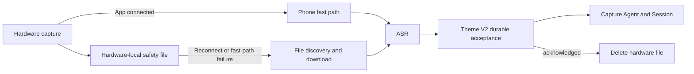

# Theme V2 Hybrid Hardware Capture Transport Design

> Date: 2026-08-11
>
> Status: Approved for implementation planning
>
> Scope: Android Theme V2 capture transport for the Chiplet Ring and W1/W2 recorder card

## 1. Goal

Make a hardware Flash feel immediate while the App is available, without losing
the recording when the screen is off, the App process is unavailable, the phone
is outside BLE range, or the phone is powered off.

The product contract is:

```text
online and connected
  -> show “正在聆听” immediately
  -> use the fastest available phone path after recording stops
  -> keep a hardware-local safety copy until the capture is durably accepted

App or phone unavailable
  -> hardware records locally
  -> reconnect discovers and transfers the pending file
  -> the same capture is accepted exactly once
```

This work changes the capture transport and recovery boundary only. It does not
replace the current Theme V2 capture Agent, Session, MCP, Asset, outbox, SSE, or
notification architecture.

## 2. Product Decisions

### 2.1 “正在聆听” remains

`正在聆听` means the hardware is actively collecting audio. It does not claim
that the backend has already received audio frames.

The visible sequence is:

```text
正在聆听 -> 正在接收 / 正在同步离线闪念 -> 正在转写
        -> 正在理解 -> 正在整理 -> 已整理
```

When the App is visible, the existing Thinking Orbs takeover starts from the
real recording-start event. When the screen is off, the same capture may
continue without a visible animation. On return, the UI renders the latest
trusted state rather than replaying earlier phases.

### 2.2 Screen-off and phone-off are different modes

- Screen off with the Android process and BLE connection alive remains an
  online capture. A foreground connected-device service keeps the process
  eligible to receive hardware events and finish local persistence.
- App force-stop, BLE disconnect, out-of-range, and phone power-off have no
  phone transport. Only a hardware-local recording can survive these states.
- A reconnecting offline recording begins at `正在同步离线闪念`; it must not
  pretend to be listening at that time.

### 2.3 The ring’s 8 MB is a safety buffer

Ring storage is not a user-facing archive. Files are retained only until the
phone has obtained a usable transcript and Theme V2 has durably accepted the
capture. Deletion is acknowledgement-driven, never timer-driven.

The implementation must measure actual usable bytes and bytes per minute on the
physical ring before selecting duration and low-space thresholds. No theoretical
ADPCM estimate is used as a release constant.

### 2.4 Near-real-time, not partial live transcription

This release targets an immediate listening state and processing within seconds
after the user stops speaking. It does not add word-by-word ASR, a streaming
backend audio socket, or partial Agent execution while the user is speaking.

## 3. Current State and Gaps

### 3.1 Ring

The current ring path streams decoded PCM over BLE into a Dart `BytesBuilder`,
runs Tencent ASR on the phone after stop, and posts only the final text to
`POST /api/flash`. The task is not durable before that HTTP request.

The ring SDK already exposes separate commands for:

- live audio streaming with `CONTROL_AUDIO_ADPCM`;
- on-device recording with `CMD_START_STOP_RECORDING`;
- file list, download, delete, memory state, and memory-full events.

The product code has not yet proven that live streaming and local recording can
run simultaneously. It also has not proven that a double-click can start and
stop local recording when no phone is connected. Today the App receives the
double-click and then sends the recording command, so powered-off-phone capture
cannot be assumed.

### 3.2 W1/W2 card

The card is already file-first. It records an Opus file, emits realtime start
and end events when connected, persists a `FlashFileTask` on the phone, syncs
the file, chooses client-sync or S3 ASR, and deletes the device file only after
the workflow reaches its durable boundary.

The card therefore provides the reference recovery model. This phase keeps its
validated BLE and file-transfer SDK behavior and aligns task identity, status,
background recovery, and acceptance tests with the ring.

### 3.3 Android lifecycle

The vendored ring plugin manifest declares the vendor `com.lm.sdk.BLEService`
as a foreground service. Its implementation is inside the closed SDK, so the
repository does not prove that it keeps the Flutter process eligible to receive
a start event, persist a task, or submit ASR while the screen is off. Theme V2
also has no App-owned capture keep-alive or lifecycle instrumentation today.

## 4. Chosen Architecture

### 4.1 Local-safe hybrid capture

The selected design treats the hardware-local file as the recovery source of
truth and the online phone path as a latency optimization.



For the ring, the preferred connected mode starts live streaming and local
recording together. Live PCM may complete ASR quickly; the local file remains a
safety copy. If simultaneous mode is unsupported, the ring uses local-first
recording and downloads the newly closed file immediately after stop. The UI
still shows `正在聆听` from the real start event, followed by `正在接收`.

For the card, the existing local-first workflow remains authoritative. The
connected path simply begins transfer as soon as the end event supplies the
closed file identity.

### 4.2 Hardware capability gate

Implementation begins with a physical capability matrix. The release mode is
selected by measured behavior:

| Capability | Required proof | Consequence |
| --- | --- | --- |
| Ring live stream and local recording can coexist | Both commands remain active; downloaded file and live PCM are valid | Use dual-path connected mode |
| Ring cannot run both commands | SDK rejects a command or either audio output is invalid | Use local-first connected mode |
| Ring double-click records without a phone | With phone powered off, a new complete local file appears | Full phone-off requirement is App-deliverable |
| Ring requires a phone command to record | No file appears without an active phone connection | Requires a firmware change outside this mobile repository |

No App-only implementation may claim powered-off-phone support unless the third
row passes. If it fails, screen-off and reconnect recovery can still ship, but
phone-off capture remains an explicit firmware blocker.

### 4.3 Stable capture identity

Every hardware file has one stable `device_capture_key` derived from:

```text
device kind + stable device id + device file id/name + device-reported size
```

The phone persists a capture task before submitting to Theme V2. The backend
accepts the stable device key in addition to `client_task_id` and enforces
owner-scoped uniqueness. A retry with identical provenance returns the existing
recording; a conflicting retry is rejected.

For an online ring capture, the phone persists a provisional attempt before it
sends recording commands, then associates the newly created ring file before
final backend submission. If the App dies before association, reconnect derives
the same identity from the file and completes it once.

### 4.4 Ring task persistence and file workflow

Ring task state is persisted per authenticated user and contains:

- stable device identity and file identity;
- capture start/end time and discovery time;
- local phone audio path and content hash when downloaded;
- fast-path transcript when available;
- backend recording, Session, and input-turn identifiers;
- retry stage, last safe error class, and device-delete-pending state.

The task state machine is:

```text
provisional -> recording -> file_associated -> downloading -> downloaded
            -> transcribing -> submitting -> accepted -> deleting_device_file -> done
```

`failed` is recoverable while the device file exists. Provider/network failures
retain both task metadata and the hardware file. Empty audio is terminal only
after a complete file or complete live buffer was evaluated.

### 4.5 Background ownership

The first choice is to reuse the vendor `BLEService` after proving, on the
target Android version, that it keeps the required BLE callbacks and Dart task
persistence alive with the screen off. Theme V2 must not add a second service
merely because one is not visible in Dart code.

If the vendor service preserves BLE but the Flutter engine is still suspended,
Android adds one minimal connected-device capture keep-alive with a persistent
system notification. It keeps process priority and owns no product or Agent
logic. Flutter and the existing native plugins continue to own BLE commands and
task projection. If even that is insufficient, the native boundary is extended
only far enough to persist raw capture/file events; it does not absorb ASR,
HTTP, Session, or Agent responsibilities.

Any App-owned service is stopped on logout or explicit disconnect. Android
permission or notification denial is represented as reduced background
reliability in device status; it is not silently ignored.

### 4.6 Backend boundary

The current Theme V2 capture service remains the sole backend. Ring text capture
adds optional trusted transport provenance:

- `device_capture_key`;
- `device_kind` and stable device id;
- device file name/id where available;
- capture start/end time;
- local audio hash and size.

These fields support idempotency, original capture-time semantics, and recovery.
Raw ring audio still stays on the device/phone in this release; after phone ASR,
Theme V2 receives the transcript through the existing capture path. The card’s
existing client-sync and S3 paths remain unchanged.

### 4.7 Capacity and deletion policy

- Never delete an unacknowledged hardware file.
- Delete an acknowledged file promptly and retry deletion after reconnect if
  the device was unavailable.
- Never overwrite the oldest unacknowledged recording to make space.
- Surface SDK memory-full as a recoverable device/capture warning.
- Compute low-space thresholds from measured usable bytes and measured codec
  rate, with a reserved safety margin of the greater of 10% usable capacity or
  one measured maximum-size Flash.
- Record capacity metrics without transcript or audio content.

## 5. Unified Presentation Contract

The existing `CaptureActivityCoordinator` remains a presentation projection.
It does not become the transfer engine.

- Connected ring/card start: `listening`, `isRealtime=true`.
- Connected file close or upload start: `receiving` with copy `正在接收`.
- Reconnected hardware file: `receiving`, `isRealtime=false`, with copy
  `正在同步离线闪念`.
- ASR: `transcribing`.
- Accepted transcript and Agent start: `understanding`.
- Agent presentation/persistence: `organizing`.
- Backend terminal states continue to win over late local events.

No transient user text is created before final ASR. If the matching daily Flash
Session is open, its existing transient user-side state follows the same
listening/receiving/transcribing projection and is replaced by one real input
turn after final ASR.

## 6. Failure Semantics

- Live PCM missing but a hardware file exists: download and continue; do not
  show terminal failure.
- Screen off: continue through the foreground service or retain the hardware
  file for recovery.
- App killed after stop but before submission: recover the persisted task and
  hardware file on next launch.
- Network unavailable: retain the transcript/task and retry idempotently.
- ASR fails: retain the hardware file; failure belongs to the capture turn when
  a turn exists.
- Backend accepts but the device disconnects before deletion: mark
  `deviceDeletePending`; delete after reconnect without resubmitting.
- Duplicate online and reconnect callbacks: merge by stable identities and
  create one recording, one Session input turn, and one set of Assets.
- Phone powered off and hardware autonomous recording is unsupported: no App
  workaround exists; report the firmware blocker rather than claiming recovery.

## 7. Non-goals

- Streaming audio to the backend while the user is speaking.
- Word-by-word transcript UI.
- Replacing Tencent ASR or the Theme V2 capture Agent.
- Redis, Kafka, Celery, or a second capture backend.
- Long-term audio history on the ring or card.
- A full firmware implementation inside this repository.
- iOS delivery; the current Chiplet Ring plugin and acceptance device are
  Android-only.

## 8. Verification Strategy

### 8.1 Automated tests

- Ring provisional task persistence, restoration, stable identity, retry, and
  acknowledgement-driven deletion.
- File-list and download event decoding, empty/malformed files, memory-full, and
  disconnect during transfer.
- Fast-path failure falling back to the same local file without duplicate
  submission.
- Card realtime/offline status alignment and existing task restoration.
- Backend duplicate and conflict behavior for `device_capture_key`.
- Original capture time retained across delayed reconnect.
- Thinking Orbs retains `正在聆听` online and uses `正在同步离线闪念`
  for recovered files.

### 8.2 Physical capability tests

1. Measure ring usable bytes and file bytes for fixed 30-second, 60-second, and
   120-second recordings.
2. Test ring live-only, local-only, and simultaneous live-plus-local modes.
3. Start and stop a ring capture while the Android screen is off.
4. Kill the App after recording stops but before HTTP submission; relaunch and
   verify exactly-once recovery.
5. Disable network during recording and restore it afterward.
6. Power the phone off, record on ring and card, then power on and reconnect.
7. Interrupt file download and verify resume/restart without duplicate output.
8. Fill storage to the safe threshold without formatting the device and verify
   that unacknowledged files are never overwritten or deleted.

### 8.3 End-to-end acceptance

For ring and card, verify:

- online `正在聆听` appears immediately;
- screen-off recording is not lost;
- reconnect recovery shows truthful offline-sync copy;
- the original capture time reaches the daily Flash Session and Timeline;
- one transcript creates one input turn and one Agent run;
- retry/reconnect does not duplicate Assets or notifications;
- hardware files are deleted only after durable acceptance;
- normal top navigation returns after the terminal Thinking Orbs dwell.

## 9. Completion Boundary

The App portion is complete when connected and screen-off paths are reliable,
ring and card local tasks recover after restart/network loss, and all automated
and physical-device gates pass.

The phone-off ring requirement is complete only when a powered-off-phone test
proves autonomous ring recording. If the ring does not create a file in that
test, the remaining work is a firmware capability and must be planned and
accepted separately.
