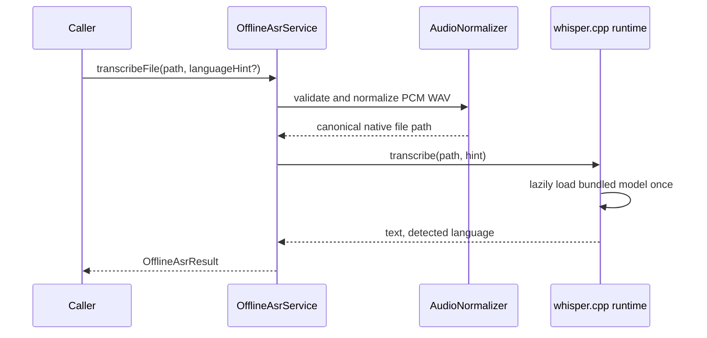

# Mobile Bundled Offline ASR Design

> Date: 2026-08-18
>
> Status: Approved direction; awaiting written-spec review
>
> Scope: Flutter mobile offline transcription service for prerecorded audio;
> UI integration is intentionally deferred

## 1. Goal

Add a reusable mobile ASR service that turns a local audio file into text
without uploading audio or depending on a network connection. The first release
uses one multilingual Whisper model bundled into the installed App and supports:

- Mandarin Chinese;
- Chinese dialects on a best-effort basis;
- English;
- Japanese;
- Spanish.

The service is built before the microphone UI. It must also remain independent
of the Ring, recorder card, Flash submission, Session, and backend domains so
those callers can adopt it separately.

The target flow is:

```text
local audio file
  -> normalize to 16 kHz mono PCM
  -> bundled whisper.cpp runtime and multilingual base model
  -> transcript plus detected language
  -> caller-owned confirmation or submission flow
```

## 2. Fixed Product Decisions

### 2.1 Offline is a hard boundary

The local microphone capture path has no cloud ASR fallback. The ASR domain
must not create HTTP clients, upload audio, or call a backend transcription
endpoint. Airplane-mode transcription is a release requirement.

Existing hardware workflows are not migrated in this service-only phase. Their
current Tencent clients remain operational until a separate integration change
moves each workflow onto the offline service. This avoids changing production
hardware behavior while the local engine is being validated.

### 2.2 The model ships with the App

The multilingual Whisper `base` model is included in the APK/AAB and IPA. It is
not an on-demand asset and is never downloaded after installation. Every user
pays the installation-size cost in exchange for deterministic offline
availability on supported devices.

The model is acquired during the build, pinned by source version and SHA-256,
and embedded into the final platform bundles. The 142 MiB binary is stored in a
release artifact cache rather than normal Git history. A release build fails if
the pinned artifact is absent or its checksum differs.

### 2.3 No public initialization workflow

Callers do not call `initialize()`. The service lazily loads the bundled model
inside the first transcription and reuses the native context until `dispose()`.
Concurrent first calls share the same in-flight load. Model loading is an
internal implementation state, not a UI or business workflow.

### 2.4 Prerecorded transcription comes first

Version one transcribes a completed local file. It does not provide partial
results, live word-by-word transcription, microphone ownership, speaker
identification, diarization, speech enhancement, or an independent denoising
stage. A later streaming design may reuse the engine but is outside this scope.

## 3. Current State

The repository currently has three separate speech paths:

- `mobile/lib/ring/ring_asr.dart` converts Ring PCM into a 16 kHz WAV, then
  delegates recognition to an injected callback.
- `mobile/lib/ring/ring_capture_service.dart` supplies a
  `TencentAsrS3Client` callback, so the Ring path is cloud ASR today.
- `mobile/lib/flash/flash_sheet.dart` directly owns the `speech_to_text`
  plugin and fixes its locale to `zh_CN`.

These implementations do not provide a general bundled-model boundary. The new
offline domain therefore sits beside them first; it does not make `RingAsr` or
the Flash widget responsible for loading a machine-learning model.

## 4. Approaches Considered

### A. Platform speech recognizers

iOS and recent Android versions expose on-device recognizers. This produces the
smallest App, but language-model availability varies by device, locale, and OS.
It cannot guarantee that every installed App has an offline recognizer and is
rejected as the primary engine.

### B. SenseVoice or a dialect-specialized model

SenseVoiceSmall is attractive for Mandarin, Cantonese, English, and Japanese,
and Dolphin provides stronger explicit Chinese-dialect coverage. SenseVoice
does not cover Spanish, while Dolphin focuses on Eastern languages. Shipping a
second Spanish model would increase package size and model-routing complexity.
This option remains a future optimization if production evidence shows that a
specific Chinese dialect matters more than the single-model constraint.

### C. Bundled multilingual Whisper base

Whisper base covers Mandarin Chinese, English, Japanese, and Spanish with one
model, includes language identification, has a mature mobile C/C++ runtime
through `whisper.cpp`, and uses MIT-licensed code and weights. The unquantized
`base` model is approximately 142 MiB. Chinese dialect accuracy is not
guaranteed and is explicitly treated as best effort. This is the selected first
implementation.

The smaller 75 MiB `tiny` model is rejected as the release default because the
size saving does not justify the expected multilingual accuracy loss. It may be
included only in engineering benchmarks, never as an automatic production
fallback.

## 5. Architecture

### 5.1 Mobile domain boundary

Create a focused domain under `mobile/lib/offline_asr/`:

```text
offline_asr/
  offline_asr_service.dart     public caller contract
  offline_asr_result.dart      transcript and language result
  offline_asr_error.dart       stable typed failures
  audio_normalizer.dart        accepted-audio validation and PCM conversion
  whisper_offline_asr.dart     production service implementation
```

The native runtime lives in a local Flutter package:

```text
mobile/packages/offline_asr_runtime/
  lib/                         narrow Dart binding
  android/                     Android CMake/JNI or FFI packaging
  ios/                         iOS CMake/Xcode or FFI packaging
  src/                         pinned whisper.cpp integration wrapper
```

The public Dart domain depends on the narrow runtime binding, not on Ring,
Flash, HTTP, authentication, or widget code. The runtime package contains no
product decisions and can be tested with direct file fixtures.

### 5.2 Public contract

The initial public contract is intentionally small:

```dart
abstract interface class OfflineAsrService {
  Future<OfflineAsrResult> transcribeFile(
    String audioPath, {
    AsrLanguage? languageHint,
  });

  Future<void> cancel();
  Future<void> dispose();
}
```

`languageHint == null` means automatic detection. Supported explicit hints are
Chinese, English, Japanese, and Spanish. Dialects do not receive fake locale
guarantees; callers use automatic detection or the Chinese hint.

`OfflineAsrResult` contains:

- normalized, trimmed transcript text;
- detected BCP-47-compatible language code;
- source audio duration.

The first version permits one active transcription per service instance.
Another call while one is active returns a typed `busy` error. This makes
`cancel()` unambiguous and prevents two CPU-heavy jobs from competing on a
phone. Empty recognized text is a successful inference result with empty text;
the caller decides whether that is a product-level failure.

### 5.3 Native execution boundary

Model loading and inference never run on the Flutter UI isolate. The runtime
executes them on a dedicated native worker or Dart worker isolate and keeps one
native Whisper context alive for reuse. `dispose()` cancels or joins outstanding
work and releases that context idempotently.

Cancellation is cooperative. The whisper.cpp abort callback checks a native
atomic flag between inference steps. A cancelled request completes with the
typed `cancelled` error and leaves the cached model context reusable.

## 6. Model and Audio Packaging

### 6.1 Model provenance

The implementation pins one exact multilingual Whisper base artifact and
records:

- upstream project and model name;
- artifact version or immutable commit;
- byte size and SHA-256;
- Whisper and whisper.cpp MIT license notices.

CI and release builds verify the checksum before platform packaging. Runtime
network access is neither required nor implemented.

### 6.2 Native model access

The model must not be loaded through Flutter `rootBundle` into a Dart
`Uint8List`; doing so would create a 142 MiB Dart-heap copy. iOS exposes the
read-only application-bundle file path directly to the native runtime. Android
packages the model as an uncompressed native asset and opens it through a file
descriptor or another native memory-mappable path. The implementation must not
silently copy a second model into application support storage.

### 6.3 Accepted audio

The ASR engine consumes 16 kHz, mono, 16-bit PCM. The service-only milestone
accepts PCM WAV files and validates their header, channel count, sample format,
sample rate, duration, and non-empty payload before inference.

`AudioNormalizer` converts other PCM WAV sample rates and stereo PCM WAV to the
canonical format without placing the whole recording in Dart memory. AAC, M4A,
MP3, and Opus decoding are deliberately excluded from this milestone. A future
phone recorder must either produce the canonical WAV directly or add a separate
native codec-normalization change before its UI is connected.

Input files are caller-owned. The ASR service neither deletes nor retains them.
Any canonical temporary file created by normalization is removed in `finally`
after success, error, or cancellation.

## 7. Data Flow and Lifecycle



The first request includes model-load latency. Later requests reuse the model.
The App may create the singleton service during normal dependency composition,
but constructing the Dart object does not load the model. No startup screen or
UI route waits for ASR readiness.

App backgrounding does not promise continued inference in version one. If the
OS suspends the process, the caller may retry the retained input file after the
App resumes. Process death never loses caller-owned audio.

## 8. Errors, Privacy, and Observability

Stable error categories are:

- `fileNotFound`;
- `unsupportedAudio`;
- `invalidAudio`;
- `modelUnavailable`;
- `modelIntegrityFailure`;
- `busy`;
- `cancelled`;
- `resourceExhausted`;
- `inferenceFailed`.

Errors may contain safe diagnostic codes but never transcript content or an
absolute user file path in production logs. Metrics may record model version,
language hint, detected language, audio duration bucket, processing duration,
peak-memory measurement in benchmark builds, outcome code, device model, and OS
version. They must not record audio, transcript text, or filenames.

An airplane-mode integration test plus a network-observation test proves that
the offline ASR package has no transcription network path. The App's privacy
copy may state that this local capture audio remains on the device only after
the UI integration separately verifies its own retention and submission rules.

## 9. Testing and Acceptance

### 9.1 Automated tests

- Contract tests use a fake runtime to cover success, empty text, explicit
  language hint, automatic detection, busy state, cancellation, and disposal.
- Audio tests cover valid 16 kHz mono WAV, resampling, stereo downmix, truncated
  header, unsupported codec, zero-length payload, temporary-file cleanup, and
  bounded-memory processing.
- Native fixture tests transcribe short Mandarin, English, Japanese, and Spanish
  clips and assert non-empty expected phrases and plausible detected languages.
- Lifecycle tests run repeated transcriptions through one cached context and
  verify disposal is idempotent and cancelled work does not poison the next
  request.
- Packaging tests inspect release artifacts to prove that the model and required
  native libraries are present for every shipped ABI and that the checksum
  matches the pinned manifest.

### 9.2 Physical-device benchmark gate

Before UI work begins, run the same fixed corpus on the oldest supported iPhone
and representative low-, mid-, and high-tier Android devices. Record:

- cold model-load time;
- warm transcription time and real-time factor;
- peak resident memory;
- thermal behavior across ten consecutive 30-second clips;
- detected-language correctness;
- character or word error rate by named language;
- qualitative results for the product's collected dialect samples.

The service milestone passes when every target device completes the corpus
offline without crash or out-of-memory failure, warm real-time factor is at most
1.0, repeated runs show no unbounded memory growth, and Mandarin, English,
Japanese, and Spanish fixtures produce usable non-empty transcripts. Dialects
are reported by sample and do not block the first service milestone because the
selected model makes no dialect guarantee.

If `base` fails the memory or real-time gate on a shipped ABI, the team does not
silently substitute `tiny`. The supported device/ABI floor or model choice must
be reviewed explicitly before UI integration.

## 10. Delivery Order and Scope Boundaries

The approved delivery order is:

1. native runtime package and bundled-model build contract;
2. Dart service, audio normalization, typed errors, and fakes;
3. automated and physical-device service benchmarks;
4. a separate phone microphone/UI design using the validated service;
5. optional later migrations of Ring and recorder-card ASR.

This design does not add or change a widget, permission prompt, recording
button, Flash submission call, backend endpoint, hardware state machine, or
cloud-provider configuration. It also does not remove `speech_to_text` or the
Tencent clients while their current production callers still exist.

## 11. Primary References

- [OpenAI Whisper](https://github.com/openai/whisper): multilingual recognition,
  language identification, model families, and MIT license.
- [whisper.cpp model files](https://github.com/ggml-org/whisper.cpp/blob/master/models/README.md):
  mobile-friendly C/C++ runtime model format and published model sizes.
- [SenseVoice](https://github.com/FunAudioLLM/SenseVoice): released-checkpoint
  language boundary used in the rejected specialist-model comparison.
- [Dolphin](https://github.com/DataoceanAI/Dolphin): explicit Chinese-dialect
  support used in the rejected specialist-model comparison.
