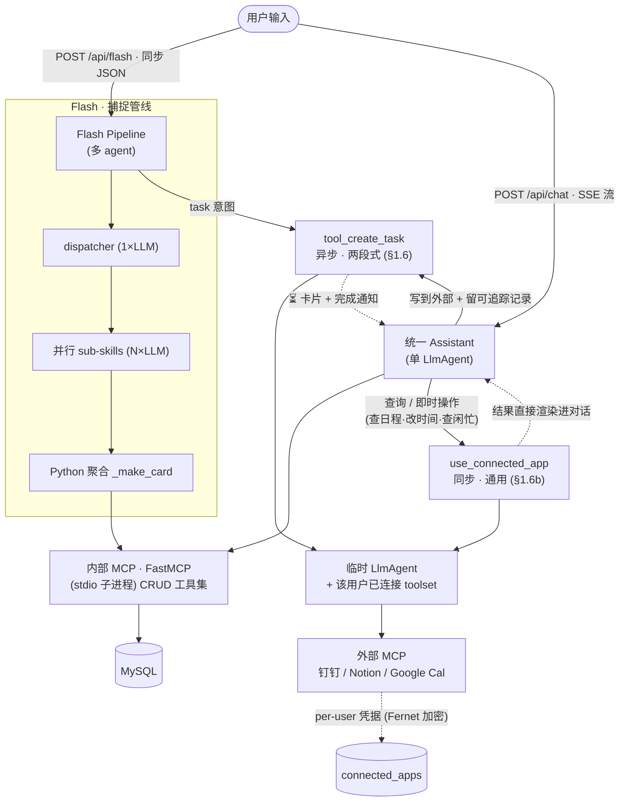
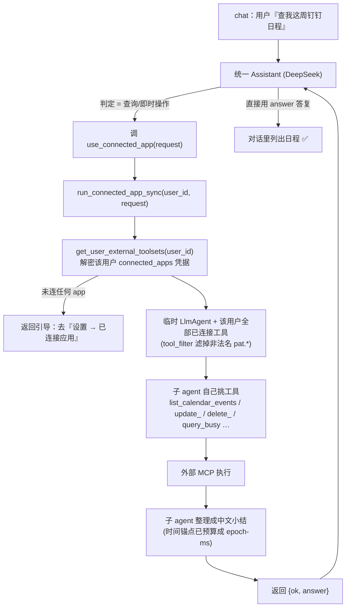

# 01 · Agent 架构与编排

> 本章描述 Eureka 后端的 AI 层：三条管线（Flash / Chat / Task）、统一 Assistant、
> 内/外 MCP 边界、LLM 配置、skill 工厂与 design agent。逐字 prompt 见
> [§A Prompts 附录](99-prompts-appendix.md)；数据落库契约见 [§2 数据模型](02-data-model.md)；
> HTTP 表层见 [§3 API](03-api-reference.md)。

---

## 1.0 全景

```
                         ┌─────────────── 用户输入 ───────────────┐
                         │                                        │
                  POST /api/flash (同步 JSON)          POST /api/chat (SSE 流)
                         │                                        │
                 ┌───────▼────────┐                      ┌────────▼─────────┐
                 │  Flash Pipeline │                      │  统一 Assistant   │
                 │  (多 agent)     │                      │  (单 LlmAgent)    │
                 └───────┬────────┘                      └────────┬─────────┘
                         │                                        │
            ┌────────────┼───────────┐                           │
       dispatcher   并行 sub-skills  Python 聚合                  │
       (1 次 LLM)   (N 次 LLM)      (_make_card)                 │
                         │                                        │
                         └──────────────┬─────────────────────────┘
                                        │
                              ┌─────────▼──────────┐
                              │  内部 MCP (FastMCP) │  stdio 子进程
                              │  CRUD 工具集         │  mcp_server/server.py
                              └─────────┬──────────┘
                                        │
                                  MySQL (17 表)

   task 意图 / tool_create_task ─────► task-skill ──► 外部 MCP (Notion/钉钉/GCal)
                                       (异步两段式)     stdio / streamable_http / sse
```

**架构图（渲染版）：**



三条管线共享同一套 **ADK + LiteLLM → DeepSeek 直连 API** 栈与同一个**内部 MCP 工具集**。
区别只在编排形态：

| 管线 | 入口 | 形态 | agent 数 | 返回 |
|---|---|---|---|---|
| **Flash** | `POST /api/flash` | dispatcher → 并行 sub-skill → Python 聚合 | 1 + N | **同步 JSON**（卡片数组） |
| **Chat** | `POST /api/chat` | 单 Assistant + 工具循环 | 1 | **SSE 流**（token + tool 事件） |
| **Task** | flash `task` 意图 / Assistant `tool_create_task` | 同步占位 + 异步 MCP 路由 | 1（临时） | 同步 placeholder，后台补全 |

---

## 1.1 LLM 配置（`core/llm.py`）

**所有 5 个角色都用同一个模型** `deepseek/deepseek-chat`（DeepSeek-V3），经 LiteLLM 走 **DeepSeek 直连 API**（`api.deepseek.com`，中国境内托管):

```python
# 按 key 选路:DEEPSEEK_API_KEY 在 → 直连;否则回退 openrouter/deepseek/deepseek-chat
# (保证没配 deepseek key 的 dev 机仍能跑;prod compose 硬要求 DEEPSEEK_API_KEY)。
_TEXT_MODEL = "deepseek/deepseek-chat" if settings.deepseek_api_key else "openrouter/deepseek/deepseek-chat"
ASSISTANT_MODEL = FLASH_DISPATCHER_MODEL = FLASH_SKILL_MODEL = DESIGN_AGENT_MODEL = TASK_MODEL = LiteLlm(model=_TEXT_MODEL)
```

> **为什么 DeepSeek 直连(不再走 OpenRouter)**:`api.deepseek.com` **中国境内托管 → 国内 inbound 稳**;
> OpenRouter(`openrouter.ai`)国内不稳/被墙,而后端要部署在公司 server(国内)。DeepSeek OpenAI 兼容、
> litellm 原生 `deepseek/` provider(tool calling ✓)。选 DeepSeek 本身的原因:中文友好、function-calling
> 纪律稳(能处理「payload 作为 JSON 字符串」的双层 JSON 模式而不截断/转义错误,Kimi 在这点挂过)、
> 非推理、快(~2-5s/call)、便宜。**Key**:`DEEPSEEK_API_KEY`(后端 `.env` / `deploy/.env.prod`,prod 必填)。
> OpenRouter key 退化为仅 §6.6.2 gemini 配图的 fallback。

**为什么按角色命名而非按模型命名**：换模型只改这里 5 个字符串，agent 代码不动（「干净接缝」原则）。

`configure_llm_env()` 在 `main.py` 启动时调用一次（**在 import routers 之前**，因为 routers import agents
会实例化 model），把 `OPENROUTER_API_KEY` / `OPENAI_API_KEY` 写进 env 供 LiteLLM 读取。
`OPENAI_API_KEY` 仅给 Whisper ASR 留位（音频上传路径本轮不实现）。

无 prompt 缓存。

---

## 1.2 内部 MCP — 我们自己的 CRUD 工具集

内部工具是一个独立的 **FastMCP** server（`mcp_server/server.py`），以 **stdio 子进程**方式由
`MCPToolset` 拉起（`agents/mcp_toolset.py:get_mcp_toolset()`，懒加载单例）。Assistant、Flash sub-skill、
design agent 共用同一个内部 toolset。env 透传（DB / LLM 凭据进子进程）。

> **启动预热(✅ `main.py` lifespan)**:子进程**懒加载**意味着**首条** chat 会承担 stdio spawn(子进程里重新 import 后端 + 连 MySQL)+ litellm provider init + DB 连接池预热的成本(实测首条 ~13.9s vs 之后 ~4.8s)。lifespan 在 boot 时后台 `get_tools()` 触发一次连接,把这≈9s 挪到服务启动而非首个用户请求。**best-effort**:try/except + 后台 task,预热失败/ADK API 变动绝不阻塞或拖慢启动(懒加载路径仍兜底)。

### 工具清单（`mcp_server/tools.py`）

所有工具统一返回 `_ok(**fields)`（带 `ok: true`）或 `_err(msg)`（`ok: false`）。

| 工具 | 签名（关键参数） | 落库 |
|---|---|---|
| `tool_create_todo` | `(content, due_date, session_id, source_input_turn_id)` | `assets`(skill=todo)——**待办专属 typed 工具**(薄封装 → create_asset) |
| `tool_create_note` | `(content, title, tags, session_id, source_input_turn_id)` | `assets`(skill=notes/随记)——**随记专属 typed 工具**(tags 逗号分隔 ≤3) |
| `tool_create_asset` | `(user_skill_name, payload, session_id, source_input_turn_id, user_id)` | `assets`（+ `asset_fields` 索引）——**仅用于 expense + 自定义 skill**(内置走上面的 typed 工具) |
| `tool_query_asset` | `(user_skill_name, contains, from_date, to_date, limit, domain?)` | 读 `assets`;`domain?` = 按生活领域过滤(8 选 1,§8.5 轻量事实查询) |
| `tool_query_digest` | `(from_date, to_date, domain?)` | 跨 skill 聚合计数;`domain?` 限定某领域 |
| `tool_update_asset` | `(asset_id, payload_patch)` | patch 合并 `assets.payload` |
| `tool_delete_asset` | `(asset_id)` | 删 `assets` |
| `tool_create_contact` / `query` / `update` / `delete` | `create(name, phone, company, title, email, notes, socials, …)`;`update(contact_id, field, value)` | `contacts`（一级表）。**socials** = `{platform: handle}`,platform **只能** ∈ `x/telegram/linkedin/wechat/xiaohongshu/instagram`（只存账号,未支持平台丢弃）。**`update field=平台`** 设该平台 handle(合并,空值取消);**`update field="notes"`** = **追加一条批注(在哪相遇/怎么认识…),绝不覆盖**;`field ∈ name/phone/company/title/email` 才是覆盖标量 |
| `tool_create_event` | `(title, start_at, end_at, location, description, all_day, recurrence_rule, source_input_turn_id)` | `events`（一级表） |
| `tool_query_event` / `get_event` / `update_event` / `delete_event` | | `events` |
| `tool_add_event_attendee` | `(event_id, name, contact_id, role)` | `event_attendees` |
| `tool_link_event_file` | `(event_id, file_id, kind)` | `event_files` |
| `tool_query_input_turn` / `get_input_turn` | | 读 `input_turns` |
| `tool_create_task` | `(user_text, content, target_external_id, target_external_system, session_id, source_input_turn_id)` | 委托 task-skill（见 §1.6） |

> **常驻系统 skill = 专属 typed CRUD 工具,自定义 skill = 通用工具(已实现)**:**名片/事件/待办/随记/外部**
> 这 5 个常驻是系统级、schema 固定的,**create** 用各自的 typed 工具(`tool_create_contact/event/todo/note`)——
> typed 参数消掉「双层 JSON 字符串」那一类 LLM 调用错误。**自定义 skill + 记账(expense)** schema 动态/普通,继续走
> 通用 `tool_create_asset(user_skill_name, payload-JSON)`。**存储统一**:contact/event 落各自一级表;todo/随记/外部/expense/
> 自定义**都落 `assets`**(todo/随记的 typed 工具只是薄封装,内部仍调 create_asset → asset_fields 索引一致)。
> **改/删/查跨类型统一按 id**(`update_asset`/`delete_asset`/`query_asset`),不为每类再开工具(by-id 不需要 typed)。
> 外部(external_ref)的 create 由 task 管线内部产生(非 agent 直建)。
> **领域(domain)增量(Layer A 已实现,横切章 §8)**:create 工具带可选 `domain` 参,落 asset 时按内容打(8 个生活领域,服务端回落:基线技能 prior → null;自定义技能无 prior、纯内容)→ 写 `assets.domain`;manual 创建/编辑由 §4 表单的 domain 选择器传入。详见 [§8 领域系统](08-domain-system.md)。

### `payload` 是 JSON 字符串（关键约定）

`tool_create_asset` / `tool_update_asset` 的 `payload` / `payload_patch` 参数是 **JSON 字符串**，
不是对象。这是「双层 JSON」模式——选 DeepSeek 的关键原因就是它能稳定地把对象序列化成字符串再传，
不截断、不转义错。复刻时 sub-skill prompt 都按这个约定写（见各 SKILL.md「payload=JSON 字符串」）。

### `tool_create_event` 的硬校验

`create_event` 内部强制：**必须有 `end_at` 或 `all_day=1`**，否则返回
`_err("...should be todo...")`。这是「只有一个时刻 = todo，有完整时段 = event」铁律的**落库层兜底**
（dispatcher 是第一层，event-skill Step 0 是第二层）。

---

## 1.3 Flash Pipeline（捕捉管线）

入口 `agents/flash_pipeline.py:run_flash_pipeline(user_text, session_id, input_turn_id, today_str, user_id)`。
三步：

### Step 1 — Dispatch（`_dispatch`）

一次 LLM 调用、**无工具**（纯分类）。agent 由 `make_dispatcher_agent(custom_skills_hint)` 构造，
prompt 来自 `skills/flash-dispatcher/SKILL.md`。输出意图列表 JSON：

```json
{"intents": [{"type": "todo", "source_text": "..."}, {"type": "expense", "source_text": "..."}]}
```

意图 `type` ∈ `todo / event / expense / contact / notes(随记) / qa / task`（+ 用户自定义 skill 的
machine_name）。一句话可拆成多个意图并行处理。

> **`随记` 合并(**已实现**,见 [§2 §3.2.1](02-data-model.md))**:`idea / notes / misc` 三者同形,已**合并成一个
> `随记`**(machine_name `notes`)—— dispatcher(flash + chat)去掉这三分支,自由文本一律 → `notes`(随记),
> 随记 skill **生成 ≤3 个开放主题 `tags`**(注入用户已有 tag 防同义漂移)。这消掉了"idea vs notes vs misc"的糊判。
> `随记` 的岛 `domain` 默认 `灵感`(升华落「灵感」领域,§7)。

**dispatcher 铁律（逐字见附录）**：
> **event 的唯一识别条件 = 有完整时段**（start+end / start+duration / 全天）。**只有一个时刻就是 todo。**

**task ≠ qa 的区分**：动作落在**外部产品**（钉钉/Notion/GCal）= `task`；问 Eureka 自己的数据或一般知识
= `qa`。

**自定义 skill 注入**：当用户注册过自定义 skill，`make_dispatcher_agent` 把 `custom_skills_hint` 追加进
dispatcher prompt，教它对关键名词命中时输出 `type=<machine_name>` 而不是倒进 misc。

> **活跃集过滤（已实现，见 [§3 skills API](03-api-reference.md) / [§4.4.5](04-frontend.md)）**：`custom_skills_hint`
> (`flash_pipeline._load_custom_skill_map`) 与 chat 的技能字典 (`session_service.load_user_skills_hint`) 都
> **WHERE enabled=1**。**停用的技能不进 hint → 不会被路由到**（该类输入回退 misc/notes）。hint 每请求现拉，
> 改活跃集**下一条消息即生效**，无需重启 agent。查询工具**不**按 enabled 过滤（停用后仍能查其历史资产）。

> **chat 技能匹配纪律（`agents/assistant.py`）**：chat 助手按技能的**语义用途**(名称 + 字段)匹配,不只看
> 字面关键词 —— 「工作日志(日期/内容/备注)」接住「沟通讨论了 X」这类工作过程记录,不再误塞 todo。配套两条
> 硬规则:**记录(已发生)≠ 待办(未来要做)**(句中日期 = 发生日、不是截止日;看动词时态判);**诚实闸 —— 没
> 成功调 create/update 工具之前绝不说「已记成 / 已创建」**,用户纠正分类(「这应该是工作记录吧」)时**真的**去
> create_asset 到正确技能(必要时 delete 掉误建的那条),做不到就如实说,不口头附和糊弄。

**fallback 时建议建技能（已实现，见 [§99](99-prompts-appendix.md)）**：当一个**像「记录某类型」**的输入因
**没有匹配的活跃技能**被归到 **misc/notes 并建好资产**后，agent 在**回复正文里追加一句**自然语言建议，
点名识别到的类型：「我把它记到了『其它』。想长期、结构化记录『宝宝喝奶』的话，可以去资产库创建一个对应技能。」
**纯文字提示，无弹窗 / 无按钮 / 无深链 / 无节流**（本版）。chat（Assistant）与 flash（misc skill）都这么做。
**只在确实建了 misc/notes 资产时提示**；没识别出意图、没建资产的（如「123123 出」）维持现状不提示。

### Step 2 — 并行执行意图（`_run_intent` via `asyncio.gather`）

每个意图并发跑。路由规则：

| 意图情况 | 执行体 |
|---|---|
| `type == "task"` | `task_skill.run_task_intent`（异步外部 MCP，见 §1.6） |
| 自定义 skill（有 UserSkill 但无 SKILL.md） | `make_custom_skill_agent(name, display_name, payload_schema, render_spec)` |
| 其他（todo/event/expense/…） | `make_skill_agent(skill_name)`（从 `skills/flash-<name>-skill/SKILL.md` 加载） |

**event 自动降级**：event sub-skill 若发现 source_text 缺完整时段，返回错误；pipeline 检测到后
**自动以 todo 重跑**该意图（dispatcher 误路由的自愈）。

每个 sub-skill agent 都挂内部 MCP toolset，自行决定 create/update/delete 并调工具。

> **时段 / 时刻抽取（配合今日页时段分组 [§4.5.0a](04-frontend.md)，新增）**：sub-skill 落 asset 时，**只在用户明说时间时**填两个可空字段（[§2 §3.6](02-data-model.md)）：**`occurred_at`**（说了钟点，如「下午3点」→当天 15:00）、**`period`**（说了**模糊时段**「早上/下午/晚上」、或由 `occurred_at` 推）。**没说时间 → 两者皆 null、agent 不臆造**；今日页 / 流此时按 `created_at`（捕捉时刻）落到当下段（默认即捕捉时刻，`period` 只为模糊时段兜底）。**说了别的天 → 落对应日**：把相对 / 绝对日期（今天 / 昨天 / 前天 / 后天 / 周一 / 3号 / 上周五…）解析成具体日子、记录落那天（复用 captured_at-落对天）；一句话含多个日子（"昨天买衣服、前天打球"）→ 拆成多条各归各日；**那天若既无钟点又无时段 → 落那天「没说时间」组**（§4.5.0a，不拿今天的捕捉时刻兜底）；**闪念按捕捉日 +1**（原话今天能回看），产出卡归各自日。event 用既有 `start_at` 推 `period`。`tool_create_asset` 增 `period?` / `occurred_at?` 参，与 `domain?` 同形；一句话多意图各自抽。**todo 没说截止：`due_at` 留空**（落段靠 `created_at`；写死 due_at 会被 §14 误判逾期）。**（impl 注 2026-06）** `create_asset` 落 `occurred_at` 此前被 `_parse_occurred` 漏 `import datetime` 静默打断 → 历史 asset 的 `occurred_at` 几乎全是 None（落段一直靠 `due_date` / `created_at` 兜底）；已修（`mcp_server/tools.py`），新数据起 `occurred_at` 正常生效。同一入参也供「在这天记一笔」传 `created_at`（[§4.5.4](04-frontend.md)）。

### Step 3 — Python 聚合（`_aggregate` → `_make_card`）

**纯 Python，不再调 LLM**。把每个意图的工具结果转成前端卡片。`_make_card` 有 4 个特殊分支
（event / task / contact / pending_contact），其余走通用 render_spec 路径
（`_build_card_from_render_spec` + `_apply_format` 镜像前端的格式化规则）。

**Fallback-success**（健壮性网）：DeepSeek 偶尔把 tool_call 结果输出成畸形 JSON 文本。
`_fallback_result_from_tool_events` 从捕获的 `tool_events`（真实工具调用记录）重建卡片，
所以即使模型最终输出坏了，只要工具真的调成功了，用户照样拿到卡片。

`note` → `notes` 的 machine_name 重命名在聚合层处理（v1.4 历史遗留）。

### 返回（同步 JSON）

`FlashResponse{ok, session_id, input_turn_id, reply, summary, cards, derived_assets, has_pending, elapsed_ms, error}`。
详见 [§3 API](03-api-reference.md)。

---

## 1.4 Flash sub-skills（`skills/flash-*-skill/SKILL.md`）

每个 sub-skill 是一段 SKILL.md prompt，由 `make_skill_agent` 加载成挂内部 MCP 的 LlmAgent。
**加 skill = 丢一个 SKILL.md + seed 一行 UserSkill + dispatcher 表加一行，零 pipeline 代码改动**
（`SKILL_FOLDER_MAP` 在 import 时从文件系统扫描，命名约定 `flash-<machine_name>-skill`）。

| sub-skill | 操作集 | 落库工具 | 关键行为（逐字 prompt 见附录） |
|---|---|---|---|
| **todo** | create/update/delete | `tool_create_asset(user_skill_name="todo")` | due_date：有时刻→ISO8601+08:00；只有日期→`"YYYY-MM-DD"`（**不猜时刻**）；无→null。update/delete 先 query keyword |
| **event** | create/update/delete | `tool_create_event`（**非** create_asset） | Step 0 时段硬检查（缺时段直接拒绝、不自降级）；create 后把所有「疑似参与人」字符串以 `name_raw` 占位为 attendee（**不查 contacts、不传 contact_id**） |
| **expense** | create/update/delete | `tool_create_asset(user_skill_name="expense")` | amount 必填；category 8 类推断；`date`(YYYY-MM-DD) + 可选 `at`(完整时间戳，按时段 canonical：早8/中12/下15/晚19/深夜23) |
| **contact** | create/update/delete | `tool_create_contact`（**非** create_asset） | name 必填；query 命中 0→create，1→update，2+→pending_confirmation（不乱改） |
| **idea** | create/update/delete | `tool_create_asset(user_skill_name="idea")` | title(≤10 词) + content(markdown，可扩 1-2 行，不编事实) |
| **notes** | create（only） | `tool_create_asset(user_skill_name="notes")` | 长文：title? + content(必) + tags?；忠于原文、可整理结构不可加事实 |
| **misc** | create（only） | `tool_create_asset(user_skill_name="misc")` | 兜底；content + tags?；可拒绝写入并报「dispatcher misroute」 |
| **qa** | 无写工具 | （只读 / 不落库） | Siri 式短答 1-3 句；问自己数据→`tool_query_asset` 再答；**绝不**说「这是未来功能」（report/外部同步都已上线） |

> qa 是 **system skill**：`payload_schema=None`、`render_spec=null`、`queryable_fields=None`，
> 不产生资产。它的输出 `answer` 由 pipeline 转成纯文本回复。

### 自定义 skill 的通用 sub-skill

`make_custom_skill_agent` 在调用时从 UserSkill 的 `payload_schema` + `render_spec` 即时拼出 prompt
（列字段、约束时间格式、要求只调 `tool_create_asset(user_skill_name=<machine_name>)`）。所以用户在
AddSkillWizard 注册的 skill 即便没写 SKILL.md 也能被 Flash 处理。

---

## 1.5 统一 Assistant（Chat 管线）

入口 `POST /api/chat`（SSE）。单个 `LlmAgent` + 内部 MCPToolset，由
`agents/assistant.py:make_assistant_agent(session_id, input_turn_id, event_id, today_str, user_skills_hint,
session_assets_hint, session_context_hint, session_subject_hint)` 构造。

`ASSISTANT_INSTRUCTION_BASE`（`assistant.py:25-203`，逐字见附录）定义统一意图表：

| 意图 | 行为 |
|---|---|
| **CREATE** | 意图明确建资产 → 直接调 `tool_create_*`，卡片显示在对话里 |
| **UPDATE** | query 定位 → `tool_update_*` |
| **DELETE** | query 定位 → `tool_delete_*` |
| **QUERY** | `tool_query_*` → 自然语言汇报（含「我这个月花了多少」这类随口问的概况）。**查询卡片只在当下展示、不进历史**（见下「查询卡片是临时视图」），所以文字要**一句总览 + 点名查到了啥**（标题/关键词级别，非只报数量），回看光看文字也心里有数 |
| **REPORT-REDIRECT** | 用户要一份**图文报告产物** → **chat 不产报告**，回一句**兜底指路**（去资产库「报告」点 ✨总结，见 [§6.8.0](06-synthesis-report.md)）|
| **CHAT-ANSWER** | 一般知识/分析（对象**不是**用户的数据）→ 直接答 |
| **CREATE-FROM-REPLY** | 把刚才的回答沉淀成资产 |
| **CHAT(+轻提议)** | 用户抛**纯主观想法/观点/感慨**（本来只会落「随记」、且**没有**记录动词）→ **先正常聊**，聊完末尾**轻轻一句**「要不要我帮你记成随记?」。**不自动建随记** |
| **CHAT** | 闲聊 |

**QUERY vs CHAT-ANSWER 的边界**：判据是「对象是不是用户记在 app 里的数据」。是→QUERY（query + 一句概述）；
否→CHAT-ANSWER（直接答）。**要一份报告产物**则是 REPORT-REDIRECT（指路，不在 chat 生成）。

**查询卡片是临时视图（不持久化，已确认的产品决策）**：chat 里 **create / update / 名片 / 事件 / task** 的卡片
会随消息存进 `Message.cards`、**回看时回放**；但 **query 结果卡片只在当下渲染（前端 `_CollapsibleQueryResult`，
§4.2.3），不写历史** —— 退出 session 再进来只剩文字。三层一致兜住这条：`chat.py:_cards_from_tool_result()`
对 `_QUERY_TOOLS` 直接返回 `[]`（"queries are intermediate"）；`persist_chat_turn` 只存 `text + cards`、不存
query 的 `tool_result`；前端回看 Message 里没有 query 的 tool_result，自然重建不出卡片。**理由**：查询是临时视图,
资产真值在资产库,冻结快照会随后续增删改变陈旧、反而误导。**代价**：回看的查询轮只有文字 —— 所以 QUERY 的文字
**必须点名查到了啥**（见上 QUERY 行），不能只报数量。

**chat ≠ 闪念（关键产品边界，已实现）**：对**自由文本的主观想法/观点/感慨**（无结构化字段、本来只能落
「随记」的内容），两条管线行为**相反**：① **闪念输入**（硬件捕捉，`flash_pipeline.py`）= 捕捉模式，
随口一说**直接沉淀**为随记；② **chat**（`assistant.py`，对话框打字）= 对话模式，**先就内容自然回应**，
聊完**再轻提议**「要不要记成随记?」，**绝不默默建、也不一上来就说"我帮你记成随记了"**。沉淀与否交给用户点头
（或点 UI 的「沉淀为资产」§4.2.4）。**例外**（照旧直接建）：用户明确说「帮我记/记成随记/存一下」，或内容是
**能匹配 skill 字典的客观事实**（跑步/喝水/记账/喝奶…）。判据：**能落进某个具体 skill 字段 → 直接记；
只是一句想法/评价 → 先聊、再提议**。

> **少数模型仍会被历史「带跑」（已加固，曾复现）**：deepseek 是单次 LLM，会**模仿对话历史里的工具调用**——
> 若该 session 历史里有「用户抛观点 → agent 建了随记」的先例（典型是规则上线前的旧轮次），模型容易**照抄**、
> 把系统规则覆盖掉，于是观点又被自动建成随记。这是**上下文污染**，不是规则没写对（干净 session 实测稳定守规）。
> 加固：prompt 里加一条**「别被历史带跑、每条从头判断、历史里的自动创建不是范例」**。用 DB 注入污染历史复现
> 验证：加固后 3/3 样本都改回「先聊 + 提议」。旧 session 的污染轮滚出最近 20 条窗口后自然消退。

**报告 = 独立入口（老 chat SUMMARY 已弃用）**：图文报告由 [§6](06-synthesis-report.md) 的独立向导
（资产库「报告」→ ✨总结）确定性产出。老的 chat SUMMARY（LLM 手写 HTML → `tool_render_report`）**已完全删除**：
意图、`tool_render_report` MCP 工具与 `render_report` 实现、chat.py report-pair 管线、mobile 失效的报告卡片全部移除。
chat / flash 只保留**兜底指路**。详见 [§6.8.0 入口策略](06-synthesis-report.md)。

**CREATE 多条记录要抽全（关键，曾漏抽）**：chat Assistant 是**单次 LLM**做多意图抽取（不像 flash 有专门
dispatcher 先拆意图），narrative 长句容易**只抓最显眼的一条**、把其余当闲聊丢掉（实测：「看了 X；又看了 Y；
喝了 500ml」有时只记了喝水）。prompt 用三条规则补齐这层 dispatcher 纪律：① **陈述「既成事实」也是 CREATE**
（「我看了/吃了/喝了 X」这类**能结构化、能匹配 skill 字典**的客观事实即记录，不是闲聊；但**纯主观想法/观点**
（落随记的自由文本）在 chat 里走上面「chat ≠ 闪念」的先聊-再提议，不自动建）；② 一条消息**先在脑内列全所有
独立记录、再逐条 create、一条不漏**；③ 夹带的主观评价（「很好看」「太文艺」）是该记录的**字段**，不是把整条
变闲聊的理由。非确定性问题，规则降低漏抽率；
彻底兜底（整条空补全）见 [§1.5 Chat SSE](#chat-sse-与防漏调) 的空补全重试。

**外部应用（钉钉/Notion/…）—— 两条路（关键，见 [§1.6b](#16b-外部应用同步通用访问use_connected_app)）**：
- **查询 / 即时操作**（查日程、看待办、改时间、查参与人、查闲忙、删日程…）→ `use_connected_app(request)`
  ——**同步、通用**，结果直接渲染进对话。**绝不**为读类请求开异步 task、说「在排队/待处理」，
  也**绝不**凭空说某 app「只能写不能读」。
- **把内容写到外部并留可追踪记录**（同步到钉钉文档 / 存到 Notion）→ `tool_create_task`，区分
  `content`（要写入外部的正文）vs `user_text`（用户原话）；更新已有外部对象传 `target_external_id`。

`make_assistant_agent` 在 BASE 之上按需追加 7 个条件块（当前时刻、当前 session 的资产/上下文/主题
提示、用户 skill 清单等），让 agent 知道「此刻在聊什么」。

### 时间上下文（now-string，关键）

`today_str` **不是**只到天的日期，而是**完整的本地此刻**：`api/chat.py` 与 `api/flash.py`
都生成 `"<ISO 到分钟>+08:00(周X)"`（例 `2026-06-04T12:41+08:00(周四)`），通过
`make_assistant_agent` / flash 管线消息（`现在是 …`）注入 prompt。

解析分**三种情况，必须分开、别混**：

| 情况 | 例 | 解析为 |
|---|---|---|
| **明确时刻** | 下午五点 / 晚上8点半 / 14:30 | 用那个时刻 |
| **相对时刻** | 刚刚 / 刚才 / 现在 / 这会儿 / 几分钟前 / 一小时前 | 用 now 的**当前时分**，**严禁** 00:00 / 午夜 |
| **只有日期词 / 完全没提时间** | 今天 / 昨天 / 明天 / 下周三 ；「今天喝了水」 | 只确定**日期**；**不要编造一个具体时刻**——datetime/时间字段**留空(不传)**或只到日期；回复里也别提用户没讲过的钟点 |

> **为什么(两次踩坑)**：
> 1. 早期 `today_str` 只到日期，模型对「宝宝刚刚喝了 150ml」这类只有相对时刻的输入只能填 00:00 →
>    所以注入完整此刻、规定「刚刚 = 真实时钟时间」。
> 2. 但随后**过度修正**：「今天喝了 20ml 水」(没给钟点) 也被塞成当前时刻 15:02,回复还断言「15:02 喝了」——
>    用户没讲过的时间被凭空发明。所以补上第三种情况:**没给时刻就别造**。
>
> 三种情况在三处一致写明：统一 Assistant 的「时间上下文」块、`skill_factory` 自定义 skill prompt 的「流程」
> 步骤、以及内建 `flash-{event,expense,todo}-skill/SKILL.md`，覆盖**所有** skill（内建 + 自定义）。

### Chat SSE 与防漏调

`api/chat.py` 把 ADK 事件流转成 SSE：`meta → token → tool_call → tool_result → done`（异常时 `error`）。
两类「这一轮什么也没产出」都会**重试一次**（`MAX_ATTEMPTS=2`），别让用户只看到「用时 Xs」的空回复：
- **漏调**：`_looks_like_leaked_call` 检测 DeepSeek 把 function-call 当普通文本吐出来 → 重试(带「请直接调用工具」的 nudge)。
- **空补全**：`is_empty = 没调任何工具 且 没有正文`。DeepSeek **偶发返回空补全**(0 token、无工具、无文本) →
  同样重试。两次都空 → 回一句「我刚才没太理解,能换个说法再说一次吗?」**绝不静默**。
`_cards_from_tool_result` 抽卡片落库。report 的对话消息会剥掉笨重的 html 再持久化。详见 [§3 API](03-api-reference.md)。

**陈旧 session_id 自愈(已修)**:客户端持久化的「活跃 session id」可能失效(会话被删 / DB 重置 / 跨设备)。
`get_or_create_chat_session` 收到**给了但查不到**的 id 时**不再抛错**,而是**回落新建一个 session**(并通过 `meta` 事件把新 id 回传客户端)——
绝不让一个陈旧 id 把 SSE 流打断(否则前端报 `ClientException: Connection closed while receiving data`)。曾因 reseed 清空 sessions 触发。

### 1.5.1 资产锚定会话的开场 hint（✅ v1 已实现 2026-06 · L0+L1;L2 后置）

> **定位**:用户可以**就某条资产发起讨论**(资产详情 → 对话 = `subject_asset_id` 锚定的 get-or-create session,§3.5/§4)。
> **第一次进入这个锚定会话**(空、无历史)时,不该是个空输入框 —— 给一个**基本 hint**(开场白 + 几个起聊建议)。
> 这也是「agent 对单条记录的简要分析/点评」的**新承载**:把点评从「卡片里的静态批注」(§6.11,**已转 pending**)挪到「**你主动找它聊时**的开场」—— 捕捉零成本、只在用户想聊时出现、且**自然引向对话**而非死批注。

**何时出现:** 仅当 `subject_type=asset` 的会话**没有任何历史轮次**(空态)。已有历史 → 直接显线程,**无 hint**。hint 是**空态脚手架,不落库为消息**(用户没接话就不污染历史);用户点了某个起聊建议 / 自己打字 → 才开始真实对话。

**hint 由两块组成:**
1. **开场白(opener)**:一句轻、grounded 的话,**可含 0-1 条观察**(本周第几笔、和上月比、连续天…)。例:记账「午餐 ¥68」→「这是你本周第 3 笔餐饮(本周共 ¥210)。想聊点什么?」
2. **起聊建议(starter chips)**:2-3 个**可点**的起聊 prompt,**按资产类型/技能**定制;点一下 = 把它作为首条用户消息发出 → 进入正常 chat 管线。

**生成逻辑 = 三层(可分期,LLM 层正是被 pending 的那块):**
- **L0 — 起聊 prompt(永远有、即时、无 LLM)**:取该技能的 **`user_skills.chat_starters`**(2-3 条,**建技能时 design agent 同一次 LLM 调用顺手产出**,§1.8 —— 几乎零成本)。
  - **基线技能**用 seed 写好的 starters:记账 → 「这个月花了多少?」「和上月比」「帮我归类」;随记 → 「帮我把这条想法展开」「升华成一篇(→§6)」「相关的还有哪些?」;待办 → 「拆成子任务」「设个提醒」「为什么重要」;读书 → 「我的读书进展?」「总结这本书」;跑步 → 「最近运动趋势?」;事件 → 「要准备什么?」「结束后记纪要」;名片 → 「记一件关于 TA 的事」。
  - **自定义技能**用其 `chat_starters`;**空(老技能/未产出)→ 退回通用三连**(看趋势 / 帮我分析 / 相关记录)。
  - 确定性、零成本,是 **hint 的地板**。
- **L1 — 计算填充(便宜、无 LLM)**:opener 里的观察由**一次聚合查询**(同 skill/同 domain 近期记录的计数/求和/连续/对比)算出(纯 SQL,grounded by construction)。无可算的就用中性开场白(「关于这条记录,想聊点什么?」)。
- **L2 — LLM 富化 hint(后置 = 原 insights)**:更自然的开场白 + 更贴的 prompt,由(被 pending 的)insight/hint agent grounded 生成,缓存到 session/asset。**这正是 §6.11 那套 agent 逻辑的去处** —— 它不再写卡片批注,而是产**会话开场**。

**v1 = L0 + L1**(模板 + 计算,**即时、零 LLM 成本**),完全够「基本 hint」;**L2(LLM 富化)随 insights 一起后置**。

**护栏(继承 §6 / §6.11)**:观察只用**查到的真实数据**、**绝不发明**;**温柔**(不训诫、不预设「你又超支」);起聊 prompt 不替用户下结论。

**落地(✅ 2026-06):** 轻端点 **`GET /api/sessions/opening-hint?subject_type&subject_id`** —— 按 **subject** 取(非 session id:ChatPage 是 pendingSubject **懒绑定**,空态时 session 可能还不存在);支持 asset(L1 本周第 N 条 + 技能 `chat_starters`/通用三连兜底)、event、contact。`user_skills.chat_starters` 列落地(迁移 0020):基线技能 seed + 存量 backfill,自定义技能由 design agent 随 draft 产出(§1.8)→ confirm 透传落库。前端 `ChatPage` 空态渲染 opener + 起聊 chips(点 = 作为首条用户消息发出);hint 不落库。L2(LLM 富化)仍后置,`session_subject_hint`/`session_assets_hint` 已注入(§1.5)可直接复用。

**即时建技能 · B「一键升级成本子」(✅ 2026-06):** 捕捉命中**可结构化却无对应技能**的内容时,misc/notes 子技能在结果里带 `suggest_skill`(识别到的 2-6 字中文类型);`_make_card` 透到卡片,前端 `SkillCard` 显「✨ 长期记成『XX』本子?」chip。点一下 → **`POST /api/skills/promote`**:design-agent 当场起草并落库技能(复用 §1.8 draft,**不让用户填技能表单**)→ 用新技能 agent 把这条**重抽成结构化资产** + 删原随记(重抽失败则把原记录改挂到新技能,技能仍建成 = 主价值不丢)→ 回传新卡片。以后同类捕捉自动归入(dispatcher 见到新技能即路由)。**护栏**:升级由**用户拍板**(一拍),不让模型默默替用户决定粒度,避免本子刷屏。**A(静默自动建,onboarding 魔法时刻当场建)** 后置。配套:`_apply_format` 加 ISO 时间兜底格式化(自定义技能常把时间存成 ISO,无 format 时也友好显示「6月11日 05:00」)。

### 1.5.1.1 会话回合的持久性：离开 / 返回不丢失

> **曾是 bug(已修复,实现见 [§1.5.1.3](#1513-chat-健壮性--实现))**:原先跑 agent + 落库**全在 SSE `stream()` 生成器里**,且用户消息也只在跑完(Phase 3)才连同回复一起落库 —— 离开 session page = 客户端断开 = SSE 生成器被取消 → 生成中断 + 一条都没落库(输入和回复全丢)。下面是修复后的目标模型。

**要求(durable turn,对齐 flash 已有的 `has_pending` 异步模型):**
1. **用户消息收到即落库**(生成**之前**),带回合 `status=pending`。**离开永远不丢输入。**
2. **生成与 SSE 连接解耦**:回合跑成**后台任务**(不在 SSE 生成器里),**客户端断开也跑到完**、落 agent 回复 + cards。**SSE 只是该后台任务的实时视图,不是工作本身的归属。**
3. **回合状态**:`pending → running → done / failed`(落在 message/turn 上,可查)。
4. **返回即对账**:回到 session → 加载线程(用户消息一定在)→ 最新回合**还在跑** → 显「分析中…」占位 + **轮询 / 走通知 SSE** 直到 agent 消息落定;**已完成** → 直接显回复/资产。
5. **(更佳,可选)重连实时流**:中途返回可重挂该回合的 token 流接着看;做不到则退到 #4 的「占位 + 对账」兜底。
6. **(次要)草稿**:已敲未发的文本本地存,返回回填(同理,但不涉及后端回合)。

**实现:** 见 [§1.5.1.3](#1513-chat-健壮性--实现)(durable turn:同步落账 + 后台回合 + SSE 实时视图 + 返回轮询对账)。

### 1.5.1.2 批量多记录输入：路由到 flash，别在 chat 里硬抽

> **现象(实测)**:一次性粘贴大量记录(7 天几十笔消费),chat **用时 168.9s**,且**卡片只到 6 月 3 日 —— 但资产库里全部都建成功了**。反馈与实际落库不符,用户**无法信任 chat 的回执**。

**诊断(已核代码):**
- **持久化 / 渲染本身正确**:`api/chat.py` 的 `persist_cards.extend()` 对**每条** tool_result 都收、`persist_chat_turn(cards=…)` 全落、前端 `for c in cards` 全渲染、**无 cap**。→ **截断不在保存/显示侧。**
- **截断在上游 ADK 运行内**:chat = **单 LLM 顺序工具循环**,模型分批 create、长跑 168s,要么命中 ADK 运行步数上限、要么模型中途「收尾」/输出截断停止再发卡(需 runtime 复现定位具体点)。
- **更根本:chat 是错的载体。** 一次粘几十条 = **捕捉 / 批量导入**,不是对话。chat 单 LLM 顺序工具循环**不是为批量多记录设计的**(§1.5「曾漏抽」已是这块的脆弱点)。这正是 **flash 管线**(dispatcher → **并行** sub-skill via `asyncio.gather`)要干的活:并行、快、专为多意图抽取。让 chat 顺序磨 30 条 = 慢(168s)+ 脆(截断)+ 贵(30 次工具往返,§12)。

**要求:**
1. **批量多记录 → 转 flash 管线**:chat 检测到「一条消息含大量可结构化记录」→ 交给 flash 风格的**并行**抽取(复用 dispatcher→parallel sub-skill,或一个专门 bulk-import 路径),而非在 chat 里顺序硬抽。
2. **反馈忠实(无论哪条管线)**:建了 N 条就**回执 N 条** —— 卡片全显示(或「+N 更多」可展开)、且 agent 收尾文案**说真话**(「已记录 30 笔消费」)。**绝不**让用户看到「只到 6 月 3 日」而以为只记了一部分。
3. **(顺带)结合 [§1.5.1.1](#1511-会话回合的持久性离开--返回不丢失) durable turn**:这种长跑回合更要持久 + 返回可对账。

**实现:** 见 [§1.5.1.3](#1513-chat-健壮性--实现)(服务端启发式检测批量 → 转 flash 并行抽取 → 回执报真实计数)。

### 1.5.1.3 chat 健壮性 · 实现

[§1.5.1.1](#1511-会话回合的持久性离开--返回不丢失)(回合持久性)+ [§1.5.1.2](#1512-批量多记录输入路由到-flash别在-chat-里硬抽)(批量路由 + 回执忠实)均已落地,纯基建(无大 prompt 改动)。

**追问补全 = UPDATE,不是重复 CREATE(✅ 2026-06,prompt 修复)**:agent 记完一条又**合理地追问缺失字段**(跑步问配速/体感、记账问商家/分类…)是好体验;但用户**补全那些字段**时,旧指令只覆盖「改成/改到 Y」这种显式更新措辞,没覆盖「回答追问」,于是 agent 把补充当成新捕捉、**又 create 一条 → 重复两张卡**(实测踩到)。修复:`assistant.py` 意图表加「**追问后补全 → UPDATE·补全**」一行 + 一条关键反例(用上一条 create 返回的 asset_id,`update_asset(payload_patch 只放新补字段)`,绝不再 create 同类)。判断依据 = 用户这轮**在回答追问 / 补字段**,而非描述**另一件事 / 另一天 / 另一类**(那才 create)。验:真实双轮「今天跑了5km」→ agent 追问 →「配速1.2 感觉很棒」→ **同一条 running 资产补上 pace/feeling,仍 1 条**。

#### A · durable turn

- **schema**:`messages.status`(迁移 `0014_message_status`,`VARCHAR(12)` default `done`;agent 消息 `running→done/failed`,user 消息 + 旧行皆 `done`)。
- **后端(`api/chat.py`)**:`/api/chat` = 「同步落账 + 后台回合 + SSE 实时视图」三段:
  1. 返回响应**之前**就 `persist_user_message`(离开不丢输入)+ `create_pending_agent_message`(`status=running` 占位)。
  2. 回合跑成 `asyncio.create_task` 后台任务(`_run_chat_turn`,脱离 SSE 生成器、`_turn_tasks` 持引用);**客户端断开也跑完** → `finalize_agent_message`(text + cards + `status=done/failed`)。
  3. SSE 只订阅 `core/chat_turns` 的**每回合 channel**(in-mem pub/sub,有界队列 + `finished` 兜底 sentinel),转发 token/tool/done;失败也落 `done` 文案(永不卡「分析中…」)。
  4. `GET /api/sessions/{id}/messages` 透出 `status`(返回对账查询)。
- **前端(`chat/chat_controller.dart`)**:`loadSession` 解析 `status`,`running` 的 agent 消息渲染为「分析中…」占位;有 in-flight 回合 → `_reconcilePending` 轮询 `/messages`(1.5s,≤150s)直到落定 → 重建 + `bumpData()` 自动出回复/资产;`_disposed`/`_pollingSession` 守护切会话/销毁。
- **行为**:发消息 → 中途离开 → 回来:输入还在 + 「分析中…」→ 落定后自动出回复/资产;客户端**永不返回也跑完落库**。
- **暂不含**:重连实时 token 流(返回走轮询对账即可);草稿本地存(已敲未发文本)。

#### B · 批量路由 + 回执忠实(纯后端)

- **检测**(`api/chat._looks_like_bulk`,服务端启发式、无 LLM):估算记录数 = `max(日期数, 金额数, record-ish 行数)`,**≥ `_BULK_MIN_RECORDS`(=8,单一可调旋钮)才判批量**。一把(3–7 条)留在 chat(顺序循环够用、保对话感);只有真·堆量(chat 会慢 + 截断)才转 flash。普通多项消息(预算闲聊 5 个金额、会议记录 1 日期 + 1 金额)**不误判**。
- **路由**:命中批量 → `_run_chat_turn` 不走 chat 顺序工具循环,改调 **`run_flash_pipeline`**(dispatcher→`asyncio.gather` **并行**抽取),拿回 `cards` + `summary`。`run_flash_pipeline` 是**纯函数**:只建资产(挂当前 `session_id` + `input_turn_id`),**不碰消息/通知/事件**(那些是 `/api/flash` 端点的事)→ 消息仍由 chat own(占位→finalize),**不重复落库**,资产留在当前 session 上下文(后续 chat 回合经 `session_assets_hint` 可引用)。
- **回执忠实**:agent 文案 = flash 的 `summary`(「已记录 N 项内容。」**真实计数**);卡片**全落** `messages.cards`(reload 经 `CardsPart` 渲染)+ **实时**经一条合成 `tool_result`(`_group_cards` 把已 tag 的卡片重组成 assets/events/contacts/tasks 数组,前端现成 `extractCards` 全解析全渲染,**零前端改动**)。批量回合同样是 durable turn。

**不做**:把 chat 改成多 agent(过度);付费墙/配额([§12](12-business-model.md))。

---

## 1.6 Task-skill（异步外部 MCP）

`agents/task_skill.py`。把「落到第三方产品」的动作包装成**两段式**，永不阻塞用户：

### 同步头（<100ms）

`run_task_intent(user_text, session_id, source_input_turn_id, user_id, content, target_external_id,
target_external_system)`：
1. 建 `tasks` 行（status=pending）+ 占位 `external_ref` asset（payload status=pending、title=截断的 user_text）。
2. `asyncio.create_task` 触发异步尾。
3. **立刻**返回 placeholder 卡片 → Flash/Chat 当场显示「⏳ pending」。

> **正文恢复网**：当 `content` 为空、且 user_text 引用了「刚刚/上面/那段…」（`_PRIOR_REF_MARKERS`），
> 从 session 里**最近一条 agent 回复**捞正文（`_recover_prior_reply`），避免外部文档只有标题没正文。
> 只取最新一条（chat 场景引用的答案紧贴保存请求；flash session 是日级复用的，往回翻会捞到无关旧内容）。

### 异步尾（3-60s，`_run_task_async`）

1. `tasks.status=running`。
2. 拉**该用户已连接的外部 toolset**（`get_user_external_toolsets(user_id)`，§1.7.1 per-user，
   非全局）挂到一个**临时 LlmAgent**（prompt `_build_task_runner_prompt(cap_hints)` 在调用时构造，
   把该用户**已连接** connector 的能力 hint 列进去）。**与同步路径 §1.6b 共用同一套临时-agent + 用户
   toolset 机制**，区别只在「异步 + 写形态抽 external_id」vs「同步 + 返回结果文本」。
3. 模型按 user_text 选**一个**最匹配的工具调用。`content` 非空时作为「要写入的正文」明确交给 agent；
   `target_external_id` 非空时走**更新**工具（不 create 新对象）。
4. `_extract_external_ref` 从工具结果里抽 `external_id`/`url`/`title`（兼容各家 MCP 的杂乱返回形状：
   下钻 `result`/`data`/`body`，union 一堆 id/url/title key 名）。成功 → asset payload status=done +
   `tasks.status=done`；失败 → status=failed + error_message + 失败 toast。
5. 两种结局都发通知（`task_done` / `task_failed`，link=asset_id）——异步任务往往在用户已经走开后
   才完成，所以通知系统在这里价值最高。

**失败处理显式**：broad-catch 是有意的（fire-and-forget worker 不能让异常静默吞掉协程）；
最多重试 1 次；无匹配工具返回 `{"ok": false, "error": "no matching MCP tool"}`。

前端轮询 `/api/tasks/{id}` 或重取 placeholder asset 来发现 pending→done/failed。

---

## 1.6b 外部应用·同步通用访问（`use_connected_app`，**已实现 2026-06**）

§1.6 的 task-skill 是**异步、写形态**（建 external_ref → 抽 external_id → 标 done 卡片）。但
**查询 / 即时操作**（查日程、看待办、改时间、查参与人、查闲忙、删日程…）需要**结果当回合就回到对话里**——
异步卡片塞不进读到的数据。所以 chat Assistant 多挂一个**同步、通用**的工具 `use_connected_app`。

> **为什么不是 read/write 特例，而是通用工具**：单个钉钉日历 MCP 就有 **26 个工具**（增删改查 + 会议室 +
> 参与人 + ACL + 闲忙 + 推荐时间 + PAT 授权…）。与其按操作类型硬编码，不如把**整套工具**交给一个临时
> sub-agent，让它**自己挑**（`list_calendar_events` 查、`update_calendar_event` 改、`delete_calendar_event`
> 删、`query_busy_status` 看闲忙…）。新工具 / 新 app 零改代码。

**调用逻辑**：`agents/assistant.py` 给 Assistant 的 `tools` 里除了内部 MCPToolset，再加一个原生
`FunctionTool(use_connected_app)`。LLM 判定为查询/即时操作时调它，把用户**完整自然语言意图**塞进
`request`。`user_id` 由 `before_tool_callback`（`make_user_id_injector`）注入（同内部工具）。

**执行逻辑**（`agents/task_skill.py:run_connected_app_sync(user_id, request)`，与异步尾共用机制）：



返回 `{ok:True, answer}`（answer = 给用户的中文结果，Assistant 直接拿它答复）或
`{ok:False, error}`（未连接 / MCP 报错 / 空结果，Assistant 据此说明）。

### 同步 `use_connected_app` vs 异步 `tool_create_task`

| 维度 | `use_connected_app`（§1.6b，同步） | `tool_create_task`（§1.6，异步） |
|---|---|---|
| 触发 | 查询 / 即时操作（查·看·改·删·查闲忙…） | 把内容**写到外部并留可追踪记录**（同步到钉钉文档 / Notion） |
| 时序 | **同步**——本回合内返回 | 两段式：同步占位卡 + 后台补全 |
| 返回 | 结果文本**直接渲染进对话** | ⏳ pending 卡 → done/failed + 通知 |
| 工具选择 | 子 agent 看**全部**工具，挑任意（含增删改查） | 子 agent 挑**一个写工具**，抽 external_id |
| 持久化 | **不建资产**（临时视图，同 query 卡） | 建 `external_ref` 资产（可追踪 / 重试） |
| 共用 | `get_user_external_toolsets` + 临时 LlmAgent + `_run_agent`（两条路同一套机制，sync/async 之差） | |

### 两个落地坑（都已修）

- **工具名过滤（`tool_filter`）**：DeepSeek/OpenAI 要求 function name 匹配 `^[a-zA-Z0-9_-]+$`；钉钉日历 MCP
  暴露 `pat.batch_plan` / `pat.batch_grant`（**带点**），**一个**非法名会让整个 `tools[]` payload **400**。
  `mcp_toolset._keep_valid_tool_name` 在构建外部 toolset 时（per-user 与全局两处）滤掉非法名工具，其余照常可用。
- **时间锚点预算**：让 LLM 自己把「本周」换算成 epoch-ms 易错（实测同一周有时查出空）。
  `_build_app_runner_prompt` 把「现在 / 今天 0 点 / 本周一 / 下周一 / 今天+30 天」的 **epoch-ms + ISO 都预先算好**
  塞进 prompt，子 agent 直接取值、不做毫秒运算。connector 的 `capability` 只给**领域级**一句话，
  具体工具 name/schema 由 MCP server 自描述（子 agent 直接看到）。

---

## 1.7 外部 MCP 注册表（`agents/mcp_config.py`）

外部 MCP 是第三方托管/社区 gateway，与内部 MCP 完全分开。`MCP_SERVER_CATALOG` 列全部已知 MCP；
`EUREKA_MCP_ENABLED`（env，逗号分隔，默认 `fake_external`）决定实际 spawn 哪些。

> **百智 MCP(设计中,[§13.2](13-baizhi-integration.md))**:加 `baizhi_meeting`(`mcp.baizhi.ai/meeting/sse`,会议)+ `baizhi_calendar`(`mcp.baizhi.ai/calendar/sse`,日历)进 catalog;SSE + Bearer = 该用户百智 token(§13.1),与 DingTalk 同款 per-user 模式。

三种 transport（`agents/mcp_toolset.py:get_external_toolset`）：

| transport | 形态 | 例 |
|---|---|---|
| `stdio`（默认） | spawn 子进程（npx / python -m），`env_keys` 透传凭据 | `fake_external`、`google_calendar`（npx @cocal/google-calendar-mcp） |
| `streamable_http` | 远程 gateway，URL（带密钥）放 env，`url_env` 指 env 名 | `dingtalk_calendar` / `dingtalk_todo` / `dingtalk_notes`（钉钉 AIHub） |
| `sse` | 同 streamable_http 但用 `SseConnectionParams` | — |

每个 catalog 条目的 `description` 是给**路由 LLM**看的能力说明，**精确到参数名**（关键防错点）：

- **钉钉日历** create：`summary`（不是 title）、`startDateTime` / `endDateTime`（ISO8601+TZ，不是 start_at）。
- **钉钉待办** create：`create_personal_todo(PersonalTodoCreateVO={subject, dueTime, executorIds})`，
  `dueTime` 是 **Unix 毫秒时间戳**（不是 ISO 串、不是秒级）。
- **钉钉文档** create：`create_document(name, markdown)`（不是 title/content）；更新用
  `update_document(nodeId, ...)`，返回 `docUrl`/`nodeId`。

`fake_external`（`mcp_server/fake_external_mcp`）是测试替身：`create_notion_page` /
`create_calendar_event` / `send_dingtalk`，永远可用，保证 demo 不挂。

**运行时只用「该用户已连接」的 toolset**（`get_user_external_toolsets(user_id)`，§1.7.1 per-user）——
task-runner（§1.6 异步）和 `use_connected_app`（§1.6b 同步）共用它；旧的全局 `get_all_external_toolsets()`
已是 dead code（见 §1.7.1 ⚠️）。**构建外部 toolset 时统一挂 `tool_filter=_keep_valid_tool_name`**：
DeepSeek/OpenAI 要求 function name 匹配 `^[a-zA-Z0-9_-]+$`，而有的 MCP（钉钉日历的 `pat.batch_plan` /
`pat.batch_grant`）暴露**带点**的名字——一个非法名会让整个 `tools[]` payload **400**，故滤掉非法名工具
（其余照常）。

### 1.7.1 Connected Apps（per-user 外部连接，**已实现 2026-06**）

> **落点**:catalog = `agents/connectors.py`(`CONNECTOR_CATALOG` + `build_connection_params`);凭据加密
> = `core/crypto.py`(Fernet,key 走 `CONNECTED_APPS_KEY` env,缺省从 jwt_secret 派生 —— **仅 dev**;`config.validate_prod_secrets()` 启动时强制:`ENV=prod/staging` 或 `JWT_SECRET` 被改过(= 真部署)时,**必须**同时设 `JWT_SECRET` + `CONNECTED_APPS_KEY`,否则**拒绝启动**,杜绝 prod 用 jwt 派生密钥);表 = `connected_apps`
> (§2.3.16,迁移 0007);API = `api/connected_apps.py`(§3.14);运行时 = `mcp_toolset.get_user_external_toolsets(user_id)`
> (task-skill 改用它);前端 = `mobile/lib/pages/connected_apps_page.dart`(入口在 👤 个人中心)。
> beta 4 个 connector:钉钉日历/待办/文档(gateway_url 粘贴)+ Notion(token)。OAuth 仍后补。
> 未连接时 task-skill 抛 `_NoConnectedAppsError` → 引导用户去「设置 → 已连接应用」。

现状是「开发者替所有人连好」:catalog 写死、`EUREKA_MCP_ENABLED` 全局开关、凭据塞共享 `mcp-credentials/`。
目标是把它拆成两层,做成**用户自管的「已连接应用」**:

- **Connector Catalog（开发者维护，= 现有 `MCP_SERVER_CATALOG`）**:"支持哪些 app"。每条声明
  `{connector_id, 名称, 图标, transport, auth_type, 需要用户填的字段(label/键名/是否密钥), 给路由 LLM 的能力说明}`。
  **beta 只开策展目录**(钉钉 / Notion / Google Cal / …),**不开任意自带 MCP**(BYO 作为后续 advanced tab)。
- **Connected Apps（per-user）**:"这个用户连了哪些 + 他自己的凭据"。落 `connected_apps` 表(见 [§2](02-data-model.md))。

**鉴权(beta):** **先做 token / 网关-URL 粘贴类** connector —— 用户把**自己的**密钥/网关 URL 粘进字段
→ **直存服务端加密**,不经过任何第三方、不回传客户端。覆盖钉钉 AIHub 网关(`streamable_http`,`url_env`)、
API key/header 型。**OAuth(Google/Notion 跳转)后补**(每家一套重定向 + 刷新)。

**运行时改造:** task runner 不再 `get_all_external_toolsets()`(全局),而是
`get_user_external_toolsets(user_id)`:读该用户的 connected_apps → **解密他的凭据** → 按连接构建 MCPToolset。
接上已做的 per-user `user_id` 线程化(同内部 MCP 的 `before_tool_callback` 注入)。**per-user 偏好
`streamable_http`/`sse` 网关型 transport**(不必为每用户 spawn 子进程,易扩容);`stdio` 仅自托管保留。

> ⚠️ **全局旧路径已停用(别再用 `.env` 配钉钉)**:`EUREKA_MCP_ENABLED` + `DINGTALK_AIHUB_URL_*`(env)
> + `MCP_SERVERS` + `get_all_external_toolsets()` 是 v1.4.x 的「开发者替所有人连好」旧设计。改造后
> **task runner 只调 `get_user_external_toolsets(user_id)`(只读 `connected_apps`)**,`get_all_external_toolsets()`
> **已无任何调用方**(dead code),`MCP_SERVERS` 只剩 `_build_task_runner_prompt` 的 fallback **文案**(且
> 该分支被前置的 `_NoConnectedAppsError` 挡掉、不可达)。所以 **env 里的钉钉网关不会被任何账号在运行时调到** ——
> 它既不是「全局生效」也不是「能用」,纯属遗留配置 + footgun。**正确做法**:`.env`/`.env.prod` 里
> `EUREKA_MCP_ENABLED=fake_external`、删掉 `DINGTALK_AIHUB_URL_*`;每个账号自己在 app「设置 → 已连接应用 → 钉钉」
> 粘网关 URL(直存服务端 Fernet 加密,scoped 到本人 `user_id`)。

**agent 感知:** assistant / task-skill 只**提供并使用已连接**的 app。用户说「同步到钉钉」但没连
→ agent 回一句引导去「设置 → 已连接应用」连上,而不是硬调一个没凭据的 toolset。运行时把"已连接 connector
清单"作为 hint 注入 task agent(类似 skill 字典 hint)。

**「同步失败 → 去连接 → 重试」闭环:** task-skill 产出的 `external_ref` 资产 payload 已带 `external_system`
(目标 connector)+ 状态(pending/failed)。当某次同步因 **app 未连接 / 凭据失效** 失败,前端在该外部资产的
容器/详情里就**深链回对应 connector 的连接卡**(见 [§4.4.2 / §4.4.3](04-frontend.md));连好后重试即可。
让"发现问题的地方"和"修问题的地方"一键打通。

**安全(契合产品硬约束):** per-user 凭据**加密 at rest**、按 `user_id` 隔离、**绝不出现在任何 API 响应/日志**、
**绝不回传客户端、绝不给开发者**;catalog 条目声明"要哪些字段",用户自己填。

> 完整数据/接口/前端契约:[§2 `connected_apps`](02-data-model.md) · [§3 `/api/connectors` + `/api/connected-apps`](03-api-reference.md) · [§4 设置 hub](04-frontend.md)。

---

## 1.8 Design Agent（自定义 skill 设计器）

`agents/design_agent.py`，被 `POST /api/skills` 调用，**两段式**（先澄清后设计）：

### Clarifier（`clarify_skill`）

输入用户的自然语言描述，判断够不够具体。输出 `{"ready": true}`（够清楚直接设计）或
`{"questions": [...]}`（太笼统，问 1-3 个关键问题让前端渲染成卡片流）。判据：含动作+数值/隐含核心字段
→ ready；只给类目名（「宝宝喂养记录」「看书」）→ 追问。最多 3 问。用 ADK `output_schema`
（`CLARIFIER_SCHEMA`）保证结构化输出；解析失败保守 fallback 到 `{ready: true}`。

### Design（`design_skill`）

产出可直接装入系统的 skill 定义：
`{name, display_name, payload_schema, render_spec, sample_payload, chat_starters}`。用 `output_schema`
（`RESPONSE_SCHEMA`）强约束。设计规则（逐字见附录）关键点：

- 字段 3-6 个；payload 里**每个有意义字段都要能在卡片上看到**（进 primary/secondary/meta，否则用户以为内容丢了）。
- `accent_color` 必须从 7 槽选（blue/amber/green/red/purple/gray/neutral）；`icon` 1 个 emoji；
  `card_layout` ∈ horizontal/stacked/inline/compact。
- **单位塞进值里或用 string 字段**——不发明 `field_units`/`primary_unit` 等已废弃 key（卡片显示规则
  极简：就是字段原始值，无标签前缀、无单位后缀）。
- `actions: "check"` 纪律：只有真正状态化的 skill（todo/打卡/review）才加，measurement/log 类
  （跑步/读书/记账）不加。
- **`chat_starters`（✅ 已实现,喂 §1.5.1 开场 hint 的 L0）**：2-3 条**起聊文案**，贴该技能的性质
  （读书技能 → 「我的读书进展?」「总结这本书」；记账 → 「这个月花了多少?」「和上月比」）。**几乎零成本**——建技能本就在调 LLM，只多产几句文案。落 `user_skills.chat_starters`（[§2](02-data-model.md)）。空则 hint 退回**通用三连**（看趋势 / 帮我分析 / 相关记录）。

产出经 `POST /api/skills/confirm` 落成一行 UserSkill（`USER_SKILL_CAP=30`）。详见 [§3 API](03-api-reference.md)。

---

## 1.8b Synthesis / Report Pipeline（合成·报告管线，✅ 已实现 —— 全貌见 [§6](06-synthesis-report.md)）

第四条管线(在 Flash / Chat / Task 之外):**report-dispatcher → content skill(按 genre)→ render skill**,
复刻 Flash 的 dispatcher→sub-skill 结构(`agents/report_pipeline.py`)。把「选中资产 + 用户意愿」合成成
**图文 HTML 报告**(数据复盘 / 灵感升华 / 提案 / 概览)。内容层只产**注解 Markdown**,渲染层 md→单文件 HTML
(surface×palette + 本地打包 GSAP,渐进增强)。内容层只用**只读** query 工具、绝不写库。
**完整规格见 [§6 合成·报告引擎](06-synthesis-report.md)**;逐字 prompt 进 [§99](99-prompts-appendix.md)。

---

## 1.8c Daily-gen Agent（游戏化层 L1，设计中）

第五个 agent 用途:**daily-gen**(`agents/daily_plan.py`,结构化输出,跟 flash dispatcher 同形)。每天跑一次,
读 L0(未完成 todo / 今日日程 / 累计计数器 / 技能字典)→ 生成**今日待完成**(基底项直给 + 触发项推断,每项带
`domain`(8 个生活领域,按内容打)+ `completion_predicate`),缓存当天。grounded 铁律:只翻译用户**已表达**的需求,绝不发明。
**design agent 扩展**:建技能时多产一个 `domain` prior(从 8 选 1)。完成任务 → `completion_events` →
扇出 长岛 / 掉装饰 / 推里程碑。**完整规格见 [§7 游戏化层](07-gamemode.md)**。

---

## 1.9 编排不变量（复刻 checklist）

1. **三管线一栈**：Flash / Chat / Task 共享 ADK + DeepSeek + 内部 MCP。换模型只改 `core/llm.py`。
2. **dispatcher 无工具**（纯分类）；sub-skill 有工具；聚合纯 Python。
3. **event/contact 走一级表工具**（create_event / create_contact），不是 create_asset。
4. **event 时段三道闸**：dispatcher 铁律 → event-skill Step 0 → create_event 落库校验。
5. **payload 是 JSON 字符串**（双层 JSON）；DeepSeek 是为这个选的。
6. **Fallback-success**：模型输出坏但工具调成功 → 从 tool_events 重建卡片，不丢资产。
7. **task 永不阻塞**：同步占位 + 异步补全 + 完成通知。
8. **skill 可扩展零代码**：SKILL.md（或动态 prompt）+ seed 一行 + dispatcher 一行。
9. **外部应用两条路**：查询/即时操作 → `use_connected_app`（同步，结果进对话，§1.6b）；写到外部 + 留可追踪记录
   → `tool_create_task`（异步卡片，§1.6）。两条共用 `get_user_external_toolsets(user_id)` + 临时 agent；
   外部 toolset 一律挂 `tool_filter` 滤掉 LLM-非法工具名（如带点的 `pat.*`）。

---

## 1.10 Agent evals + 重构路线（codex review，进行中）

**Agent evals（已实现,回归网）** `backend/evals/`(`scenarios.py` + `run_evals.py`,见该目录 README):
13 条中文场景跑**真实** chat/flash 管线,断言**可观测行为**(调了哪个工具 / skill / domain / create-vs-query-vs-redirect)——
不断言措辞。`docker exec … python -m evals.run_evals`,退出码 0 = 全绿。基线 2026-06-05 = **13/13**。
覆盖:技能路由、按内容打域(§8)、chat≠闪念、显式沉淀、query-not-create、报告独立入口、event-vs-todo、flash 多记录。
**这是底下重构的安全网 —— 重构期间必须保持绿。** 新增 agent 行为时**同 PR 加一条场景**(没断言就会漂)。

**重构路线(codex 建议,排序中):** 当前是 4 条并行管线 + 两套意图路由(chat 的 `ASSISTANT_INSTRUCTION_BASE` vs
flash dispatcher/sub-skills)+ 全量工具 schema 注入 + 超长 prompt + 多个 provider-specific fallback。逐步抽:
① **AgentRunner(已实现 2026-06)** = `core/agent_runner.py`(`run_agent(agent, message, user_id) -> AgentRunResult{text, tool_events, usage_tokens}`):
**批量(非流式)一次性 ADK run 的唯一落点**。flash/report/task 经 `flash_pipeline._run_agent`(现为薄委托,保留 `(text, tool_events)` 元组、零改动调用方)统一走它;
design_agent 两处手写 loop 已迁移;新增了**用量记账**。chat 仍保留自己的**流式**循环(要边流边发 SSE + 重试),只共享 `core/event_mapper` 事件解析——后续再抽 `run_stream`。
② **ToolGroundTruthResolver**(信工具结果胜过坏文本,把散在各管线的 fallback 收口)③ **StructuredOutputParser**(schema 感知的 JSON 解析/修复)④ **IntentRouter**
(chat/flash 共享意图枚举 + 边界测试,消除同句漂移)⑤ token 削减(按意图给工具子集、top-k 技能 schema、结构化历史)。
**先上 evals(已做)再动这些**;别在抽公共层之前堆 pet/game(§7/§9)。详细 finding 见 `codex-review/implementation-tech-review.md`。
